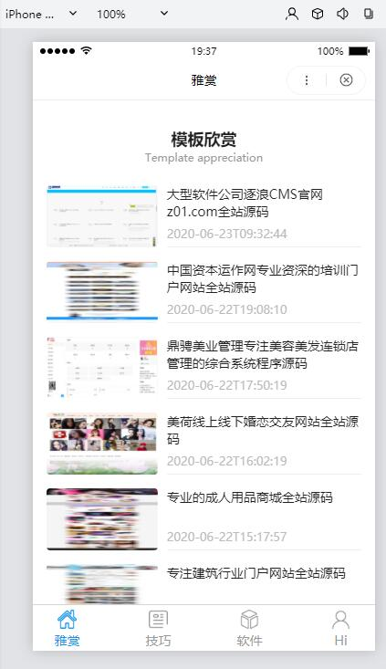
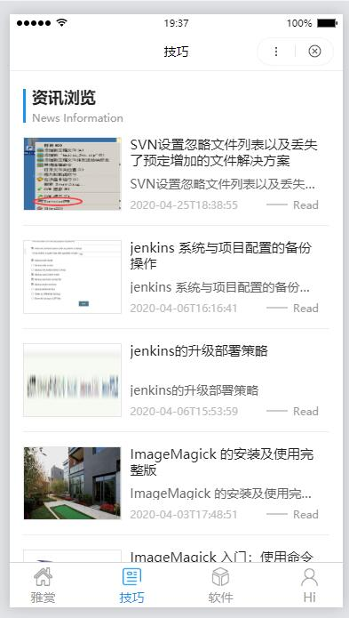
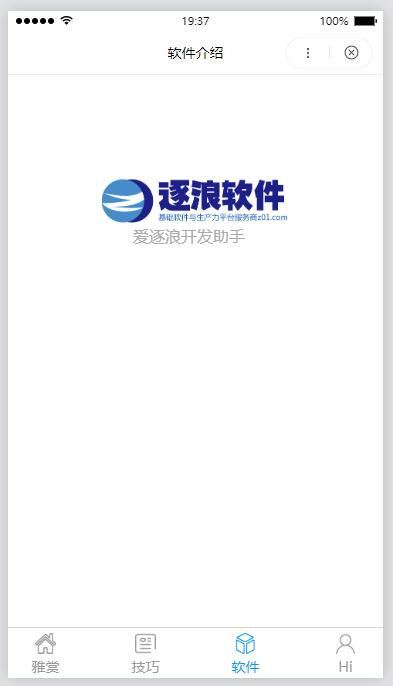
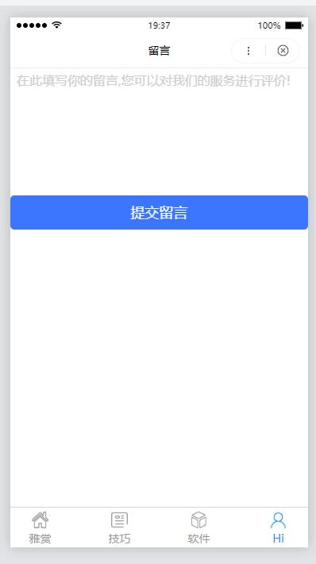
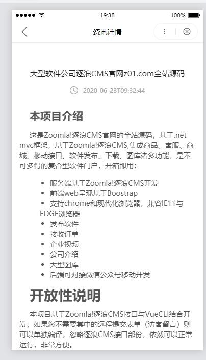
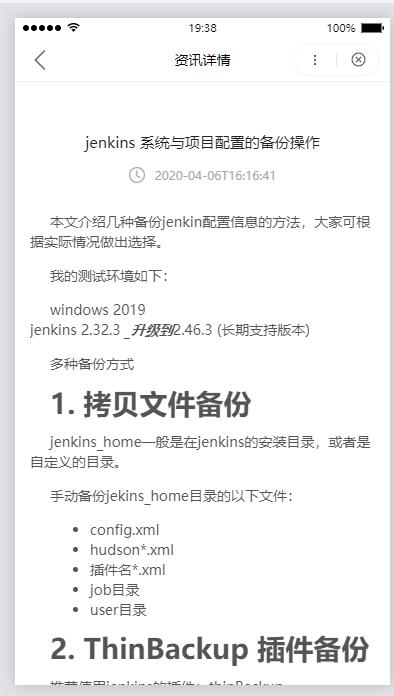
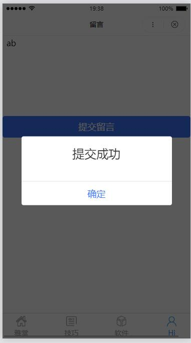
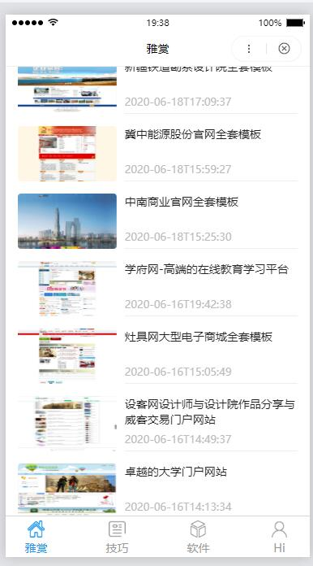

[目录]

<!-- TOC -->

- [Zoomla!逐浪CMS卓越出品](#zoomla逐浪cms卓越出品)
    - [逐浪官方开源精品全站项目052：逐浪百度小程序@爱逐浪开发助手](#逐浪官方开源精品全站项目052逐浪百度小程序爱逐浪开发助手)
    - [本项目介绍](#本项目介绍)
    - [开放性说明](#开放性说明)
    - [使用说明](#使用说明)
    - [接口配置](#接口配置)
- [接口文档](#接口文档)
    - [ZoomlaCLI-Studio接口使用说明](#zoomlacli-studio接口使用说明)
- [系统运行效果图](#系统运行效果图)

<!-- /TOC -->

  

 

# Zoomla!逐浪CMS卓越出品

## 逐浪官方开源精品全站项目052：逐浪百度小程序@爱逐浪开发助手

Zoomla!逐浪CMS：中文业界alexa排名第一的CMS系统|专注.net与windows平台企业级研发，集成内容管理、webfont、商城、店铺、黄页、教育、考试、3D、三维全景、混合现实、CRM、ERP、OA、论坛、贴吧等为一体，打造国内高端的CMS产品典范。

官网：www.z01.com

免费下载：www.z01.com/mb

视频教程：www.z01.com/mtv

模板资源：www.z01.com/mb

逐浪字库： http://f.ziti163.com

zico中文图标库：http://ico.z01.com

QQ交流群号：
      

官方QQ客服：
   

## 本项目介绍

这是Zoomla!逐浪CMS官方开发的百度小程序源码，基于接口传递数据，主要功能有：
- 与逐浪CMS完美结合
- 自由获取远程数据
- 可以进行丰富的二次开发
- 能够完成支付、留言、文章、图库诸多发布方法
- 进行深度的二次开发
- 与逐浪商城、OA、办公、能力中心完美结合

手机百度扫码体验：

## 开放性说明
本项目基于Zoomla!逐浪CMS技术栈开发，可进行深度二次开发，非常方便。
有道是：

- 建网站,选逐浪。
- 易上手,功能棒。
- 质量好,服务善。
- 高性能,最划算。

## 使用说明

- 1.接口配置应结合Zoomla!逐浪CMS 8.x
- 2.脚本框架：.net 4.0 集成模式（即IIS进程池应选为集成模式）。
- 3.数据库：MSSQL 2005(推荐使用MSSQL2016)
- 4.最低操作系统：windows server 2003

## 接口配置
- 1.接口配置文件：`接口配置文件/BDAPP.cshtml`
- 2.此文件部署应放于逐浪CMS源码目录`/Pages/API/`
- 3.更多调试信息请访问 http://Help.z01.com 或 http://bbs.z01.com 讨论。

# 接口文档
## ZoomlaCLI-Studio接口使用说明
 [ZoomlaCLI-Studio接口使用说明](源码与接口使用说明/ZoomlaCLI-Studio接口使用说明.md)

# 系统运行效果图

